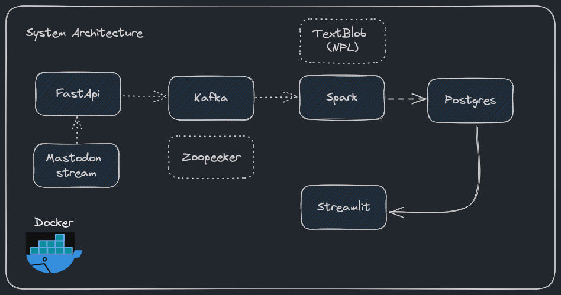
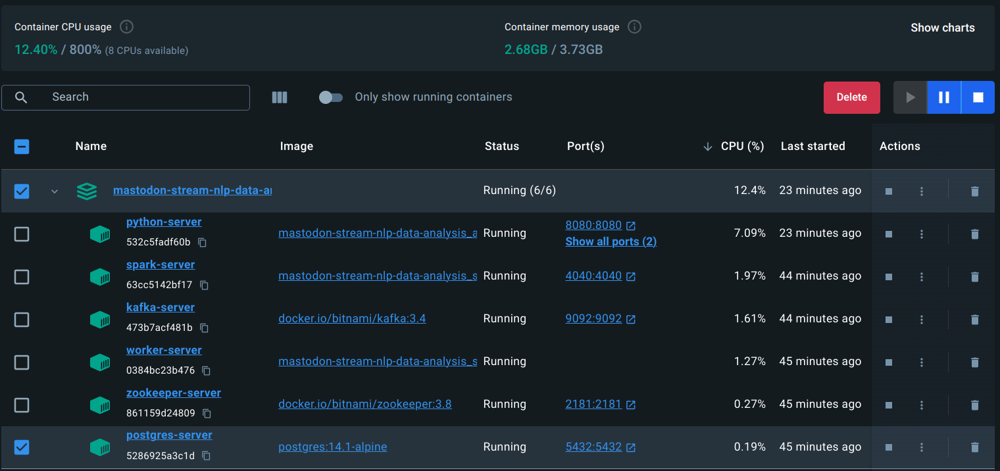
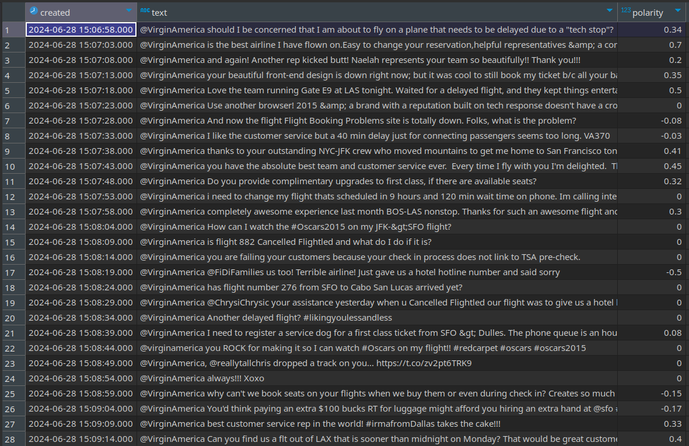
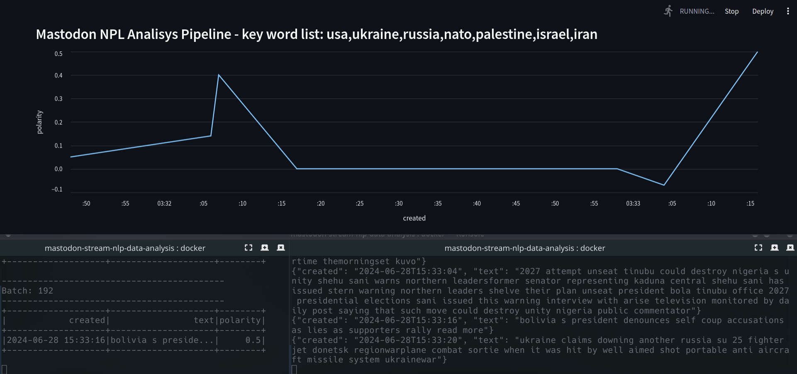

# Mastodon Stream NPL Data Analysis P2

This repository contains source files for Mastodon stream NLP polarity analysis. I built an end-to-end batch pipeline, keeping everything simple and understandable. There are two ways to generate streaming data:

1. Using a Mastodon account and obtaining an AccessToken (it's free).
2. Generating a fake stream of data (included in these files).

Either way, you will be able to run the pipeline and observe how these services work together.


## Architecture



This data engineering project, includes the following:

1. **`Mastodon Stream API`**: Source events for real time via HTTP connection.
2. **`FastApi`**: Web framework for building APIs with Python. 
3. **`Apache ZooKeeper`**: Manages the distributed environment.
4. **`Apache Kafka`**: A distributed streaming platform.
5. **`Apache Spark`**: Process the streaming data and to run polarity algorithm.
6. **`TextBlob`**: Python library for processing textual data.
7. **`PostgreSQL`**: Relational database to store the enriched data.
8. **`Streamlit`**: Allows to create interactive web apps from Python scripts.
9. **`Docker`**: To run container applications.


## Requirements

Make sure you have installed the latest version of Docker Compose

## Build and spin up services

The first step is build and start all the services in [docker-compose.yml](docker-compose.yml)

```
cd ./mastodon-stream-nlp-data-analysis

docker-compose up -d
```

If you have installed docker desktop you should see something similar to this:



Now we need to start the producer!

```
curl localhost:8080/streaming_csv
```

This will send to kafka service a json string every 5 seconds

If you want to see it in action (optional):

```
docker exec -it kafka-server bash

/opt/bitnami/kafka/bin/kafka-console-consumer.sh --bootstrap-server kafka:9092 --topic kafka_topic
```

The output will be the same that previuos command

Now we need to start the batch process:

```
docker exec -it spark-server bash  

cd /code/src/spark

spark-submit \  
--packages org.apache.spark:spark-sql-kafka-0-10_2.12:3.2.3 \  
--conf spark.driver.extraJavaOptions="-Divy.cache.dir=/tmp -Divy.home=/tmp" \  
--driver-class-path postgresql-42.6.2.jar \  
--jars postgresql-42.6.2.jar \  
--master spark://spark:7077 \  
--deploy-mode client \  
--driver-memory 3g \  
--num-executors 2 \  
--executor-cores 4 \  
--executor-memory 3g \  
./main.py
```

The batch process save the data enriched in PostgreSQL table called stream:



And now we need to connect to python server to start the streamlit app:

```
docker exec -it python-server bash  

cd src/app/streamlit  

streamlit run main.py
```

And finally, open the following url in your web browser:

http://localhost:8501/



And that's it, now you have end-to-end streaming pipeline running locally!


